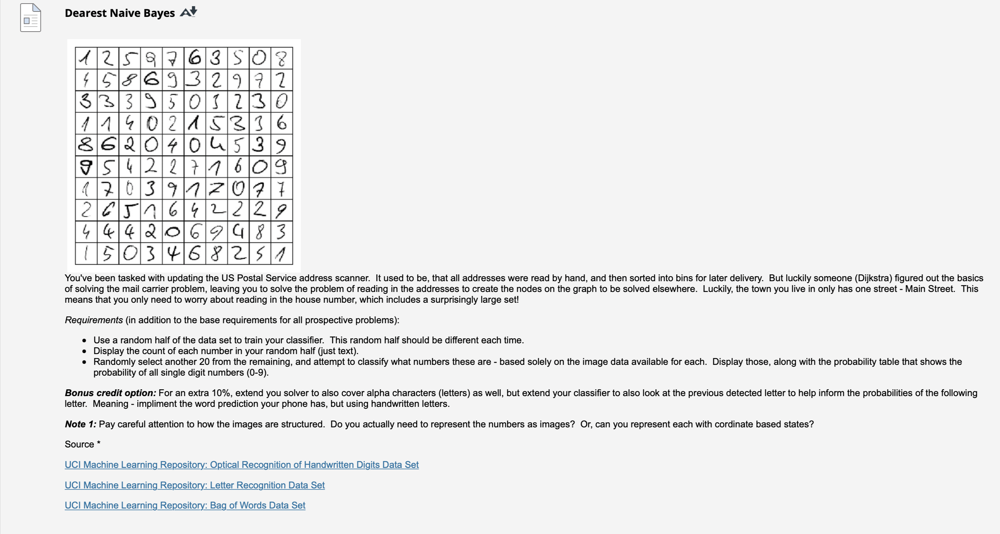
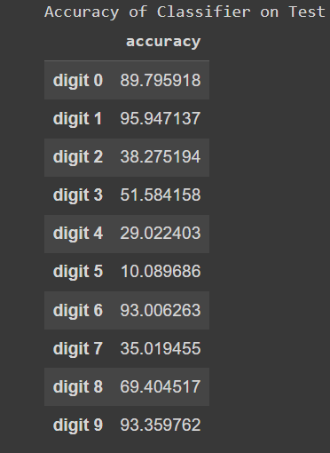

# Handwritten Digit Recognition with Naive Bayes

This repository contains a Jupyter Notebook (`DigitClassifier.ipynb`) that demonstrates the use of the Naive Bayes classifier for recognizing handwritten digits. It uses the UCI Optical Recognition of Handwritten Digits dataset, which consists of 8x8 images of handwritten digits.

* Problem
  

# Table of Contents

- [Introduction](#introduction)
- [Getting Started](#getting-started)
- [Usage](#usage)
- [Results](#results)
- [License](#license)

## Introduction

The Jupyter Notebook (`DigitClassifier.ipynb`) in this repository demonstrates the following:

1. Importing necessary Python libraries, including NumPy, Pandas, Matplotlib, and scikit-learn.
2. Importing the Multinomial Naive Bayes classifier from scikit-learn.
3. Loading the UCI Optical Recognition of Handwritten Digits dataset.
4. Splitting the dataset into training and testing sets with a 50% split size.
5. Training a Naive Bayes model on the training data.
6. Making predictions on the test data and calculating the accuracy score.
7. Visualizing the results by showing the predicted labels for random 20 images.
8. Building a probability table for all single-digit numbers.

## Getting Started

To run the Jupyter Notebook on your local machine, follow these steps:

1. Clone this repository to your local machine:

```bash
git clone https://github.com/Shubham722-227/Digit_Classifier.git
```

2. Navigate to the project directory:
```bash
cd Digit_Classifier
```

3. Install Jupyter Notebook (if you haven't already):
```bash
pip install jupyter
```

4. Start Jupyter Notebook:
```bash
jupyter notebook
```
5. Open the Jupyter Notebook (DigitClassifier.ipynb) in your browser.

6. Run the notebook cell by cell to execute the code.

## Usage
The Jupyter Notebook can be used as a starting point for handwritten digit recognition tasks using Naive Bayes classifiers. You can modify the dataset, use different classifiers, or further customize the code to fit your specific requirements
## Screenshots
* Accuracy
  



## Results
The Jupyter Notebook provides the following results:

* Naive Bayes score: The accuracy score of the Naive Bayes model on the test data.
* Counts of each number in the random split.
* Predictions on 20 random images.
* Probability table for all single-digit numbers.
You can analyze these results to understand the performance of the model.
## Authors

- [@Shubham Singh](https://github.com/Shubham722-227)


## License

[](https://choosealicense.com/licenses/mit/)

